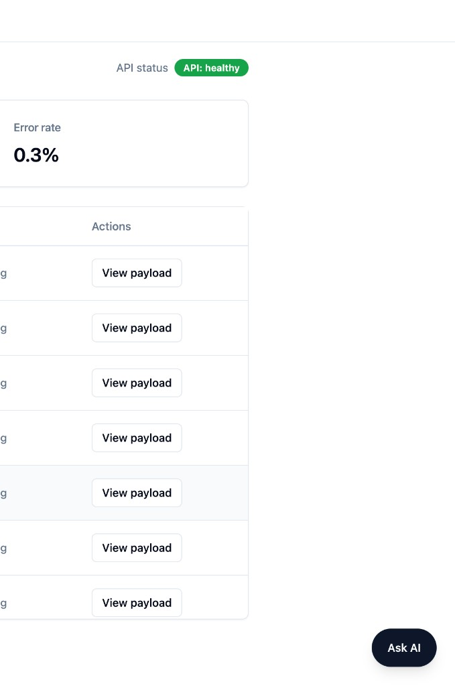
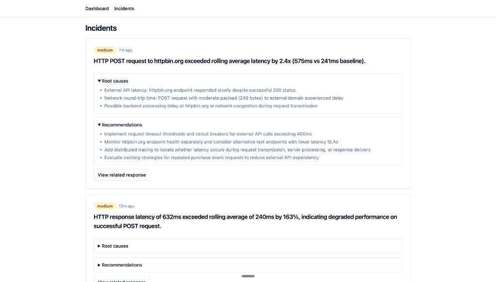
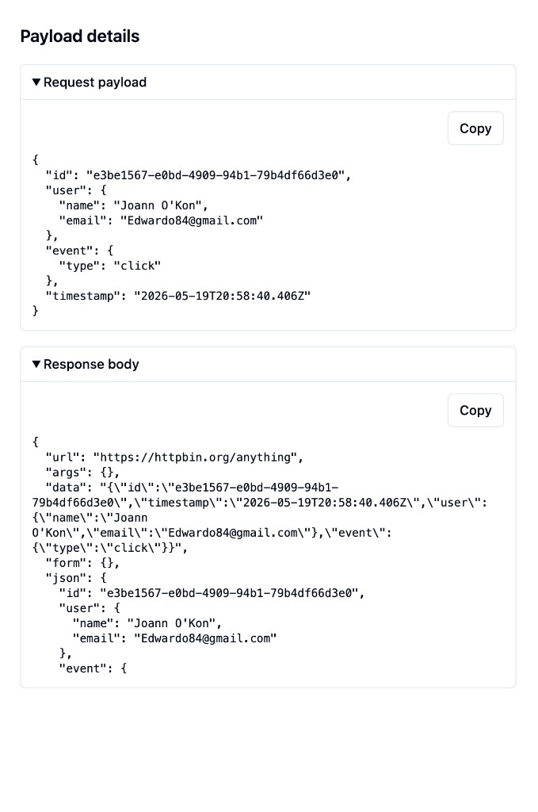

# httpbin Monitor

A full-stack monitoring app that POSTs randomized JSON payloads to [httpbin.org/anything](https://httpbin.org/anything) on a schedule, persists every result to PostgreSQL, and streams new rows to a live dashboard over Socket.IO.

**Take-home enhancement: Option B — LLM-Powered Insights** — natural-language chat over monitoring data, automatic incident reports when latency exceeds **2×** the rolling average, payload-aware analysis via the chat tool, and explicit cost controls (cache, rate limit, token budget). Detailed cost write-up: [`docs/ai-cost.md`](./docs/ai-cost.md)..



## Live demo

|         | URL                                                             |
| ------- | --------------------------------------------------------------- |
| **Web** | https://web-production-9ea3e.up.railway.app/                    |
| **API** | https://httpbin-monitor-cwws0q-production.up.railway.app/health |

**Repository:** https://github.com/ornelasedward/httpbin-monitor (public — reviewers do not need an invite).

## Architecture

The repo is a pnpm workspace with a thin shared types package and two applications. The API owns scheduling, persistence, REST, WebSockets, and the AI module. The web app is a read-mostly client that hydrates from REST and stays current via Socket.IO.

```
apps/
  api/      Node + Express + Socket.IO + Prisma + Anthropic SDK
  web/      React + Vite + Tailwind + shadcn/ui + TanStack Query
packages/
  shared/   TS types, event constants, MONITORED_ENDPOINT
```

On each tick, the scheduler invokes the ping worker. The worker generates a faker payload, POSTs to httpbin with a 10s timeout, measures round-trip time, and classifies the outcome (2xx, HTTP error, timeout, or network failure). It persists a row via Prisma and broadcasts `ping:new` with the saved record. These paths are independent: a DB failure is logged without killing the timer; a broadcast failure does not roll back the write.

The web client loads history with `GET /responses` (cursor pagination) and prepends live rows when `ping:new` arrives. The AI layer adds `POST /ai/chat` (SSE streaming, tool-assisted queries) and a 60-second incident monitor that calls Claude with forced tool-use so structured output is guaranteed before it hits Postgres.

## Tech stack

| Choice                      | Why                                                                                    |
| --------------------------- | -------------------------------------------------------------------------------------- |
| **TypeScript (strict)**     | Shared wire types in `packages/shared` keep API, client, and Socket.IO events in sync. |
| **Express**                 | Minimal server with middleware and routing; handlers stay explicit.                    |
| **PostgreSQL + JSONB**      | Indexed columns for timestamp/status/latency; JSONB for arbitrary httpbin echoes.      |
| **Prisma**                  | Migrations, type-safe queries, and Studio for debugging.                               |
| **Socket.IO**               | Reconnection with backoff and long-polling fallback out of the box.                    |
| **node-cron + setInterval** | `setInterval` under 60s (cron is unreliable sub-minute); cron at 60s+.                 |
| **TanStack Query**          | Infinite query for pagination; `setQueryData` prepends live rows with dedupe by id.    |
| **shadcn/ui**               | Components copied into the repo — no design-system version skew.                       |
| **pnpm workspaces**         | One lockfile, fast installs, `pnpm -r` for scripts.                                    |
| **Claude Haiku 4.5**        | Fast and cheap enough for tool-use loops (chat + incidents).                           |

## Core component and testing

**Ping worker** (`apps/api/src/ping-worker.ts`) is the core component: payload generation, httpbin POST, timing, error classification, persistence, and Socket.IO broadcast. Factory pattern (`createPingWorker(deps)`) with injected deps; tested with `vi.fn()` only (no nock, no Docker). Comprehensive coverage in `ping-worker.test.ts` (10 tests): happy 200, 4xx, 5xx, timeout, network error, DB failure, broadcaster failure, payload uniqueness, response timing, and sequential runs.

Supporting tests cover dashboard stats, **incident anomaly detection** (`incidents.test.ts`), incident parsing, AI cache + limiter, API routes, scheduler resilience, and web flows (dashboard, responses/incidents tables, socket cache, API client).

**CI** (`.github/workflows/ci.yml`) on push/PR to `main`: ESLint, **Prettier** (`pnpm format:check`), `tsc --noEmit`, full test suite with Postgres, coverage artifact.

## AI features (Option B)


### 1. Natural-language query interface

- **Ask AI** chat widget — questions like _"What were the slowest response times today?"_ or _"Summarize any issues in the last 24 hours"_.
- Backend tool `query_responses` (enum-only params) builds safe Prisma queries; the model must call it before citing numbers.
- Answers stream over SSE via `fetch` (not `EventSource`, which cannot POST).

### 2. Automatic incident reporting

- Every **60s**, success responses in the last **5 minutes** above **2×** the rolling **1-hour** average trigger an incident.
- Claude fills `report_incident` (forced tool-use): severity, summary, root causes, recommendations.
- Stored in Postgres; **Incidents** tab; live `incident:new` over Socket.IO.
- UI shows **endpoint** (`httpbin.org/anything`) on each incident.



### 3. Smart response analysis

Option B asks for payload analysis, categorization, and NL summaries. This project implements that **through the chat assistant and response detail UI** (not a separate batch pipeline):

| Capability             | How                                                                                              |
| ---------------------- | ------------------------------------------------------------------------------------------------ |
| Analyze httpbin echoes | Tool returns `requestPayload` + `responseJson` (parsed `responseBody.json`) for recent/slow rows |
| Patterns & aggregates  | Metrics: count, avg, p95, error rate, list_slowest                                               |
| NL summaries           | User asks in chat; model calls `query_responses` then summarizes                                 |
| Inspect raw JSON       | Dashboard **View payload** opens request/response JSON                                           |



Suggested prompt (also in the chat UI): _"Summarize payload patterns in the last 24 hours"_.

### 4. Cost optimization

See **[`docs/ai-cost.md`](./docs/ai-cost.md)** for token scenarios, cache keys, limiter behavior, and dashboard estimate methodology.

Summary:

- LRU cache (100 entries, 1h TTL) keyed by question + data fingerprint.
- Sliding-window limiter: max **20 LLM calls/hour** per instance (chat + incidents).
- Pre-call token check via `messages.countTokens` against `AI_MAX_INPUT_TOKENS` (default 8000).
- Forced tool-use for incidents avoids parse-retry loops.
- Missing `ANTHROPIC_API_KEY` does not crash the app — chat returns 503, pings continue, incidents use fallback text if LLM is skipped.

Usage: header **AI N/20 · est. $X** and chat footer via `GET /ai/usage`.

## Assumptions

- **Single monitored endpoint** — `https://httpbin.org/anything` only; no multi-target config UI.
- **Anomaly rule** — 2× rolling 1-hour average on **2xx** responses; 5-minute detection window; poll every 60s (not sub-second anomaly detection).
- **Rate limit** — in-memory per API instance; multiple API replicas would each have their own 20/hr cap unless shared state is added.
- **Cost display** — `GET /ai/usage` uses a heuristic (500 in / 300 out tokens per acquired call), not per-request billing from Anthropic.
- **Chat scope** — monitoring data only; off-topic questions are refused in the system prompt.
- **Development pings** — `PING_INTERVAL_SECONDS=10` locally for faster feedback; production default **300** (5 minutes) per spec.
- **Local web port** — Vite serves on **5173** by default, or **5174** if 5173 is in use; the API allows both for CORS/Socket.IO without setting `FRONTEND_ORIGIN`.

## Future improvements

- **Redis-backed rate limiter** and cache for multi-instance API deployments.
- **Playwright E2E** for dashboard + chat happy path.
- **Dedicated payload tagging** (size/complexity) if moving toward Option C-style filters.
- **Webhook/email** on high-severity incidents.
- **Codecov** or PR coverage comments (artifacts uploaded today).
- **Foreign key** `Incident.responseId → Response.id` with cascade rules.

## Setup

**Prerequisites:** Node 20+ (CI uses 22), pnpm 9+, Docker Desktop, Anthropic API key (for AI features).

```bash
git clone https://github.com/ornelasedward/httpbin-monitor.git
cd httpbin-monitor
pnpm install
cp .env.example .env                  # set ANTHROPIC_API_KEY (FRONTEND_ORIGIN optional locally)
cp apps/web/.env.example apps/web/.env
docker compose up -d
pnpm --filter api prisma:generate
pnpm --filter api prisma:migrate:dev --name init
pnpm dev
```

- **Web:** `http://localhost:5173` or `http://localhost:5174` (whichever port Vite prints — usually **5173**; **5174** if 5173 is busy)
- **API:** http://localhost:3001

Local CORS/Socket.IO accepts **both** ports unless `FRONTEND_ORIGIN` is set to a single URL. If `.env` has only `FRONTEND_ORIGIN=http://localhost:5174`, remove it or use `http://localhost:5173,http://localhost:5174`.

For development, set `PING_INTERVAL_SECONDS=10` in `.env` so pings arrive every ten seconds. The default `300` matches the five-minute spec.

## Deployment (Railway)

**Step-by-step guide:** [`docs/railway-deploy.md`](./docs/railway-deploy.md) (checklist, variable references, troubleshooting).

Connecting GitHub deploys your **app code only** — you must add **PostgreSQL** yourself. One Railway project needs **three resources**:

| #   | Resource      | Config file          | Role                                    |
| --- | ------------- | -------------------- | --------------------------------------- |
| 1   | PostgreSQL    | _(Railway database)_ | Database — not created from the repo    |
| 2   | `api` service | `railway/api.toml`   | Express, scheduler, AI, Socket.IO, REST |
| 3   | `web` service | `railway/web.toml`   | Vite static build + dashboard UI        |

### Quick deploy (first time)

1. [railway.app](https://railway.app) → **New Project** → **Deploy from GitHub** → this repo, branch `main`.
2. **+ New** → **Database** → **PostgreSQL** (wait until it is online).
3. **+ New** → **GitHub Repo** → same repo → rename service **`api`**.
   - **Settings** → Config file: `railway/api.toml`
   - **Networking** → **Generate domain**
   - **Variables:** `DATABASE_URL` = **reference** Postgres `DATABASE_URL` (never paste `localhost` from `.env`), `NODE_ENV=production`, `ANTHROPIC_API_KEY`, `PING_INTERVAL_SECONDS=300`
4. **+ New** → **GitHub Repo** → same repo → rename service **`web`**.
   - **Settings** → Config file: `railway/web.toml`
   - **Networking** → **Generate domain**
   - **Variables** _(before first web build):_ `VITE_API_URL` and `VITE_WS_URL` = `https://<your-api-domain>` (same URL, `https://`, no trailing `/`), `VITE_PING_INTERVAL_SECONDS=300`
5. On **api**, set `FRONTEND_ORIGIN` = `https://<your-web-domain>` (no trailing `/`).
6. **Deploy** both services (or push to `main`). API runs DB migrations in a **pre-deploy** step (see `railway/api.toml`), not during the image build.
7. Smoke test: API `/health` → `{ "ok": true }`; open the web URL; dashboard should show pings every **5 minutes** (`300`).

**Do not** set **Root Directory** on `api` or `web` (monorepo builds from repo root).

### After changing variables

| Change                         | Redeploy          |
| ------------------------------ | ----------------- |
| `VITE_*` on web                | **web** (rebuild) |
| `FRONTEND_ORIGIN` on api       | **api**           |
| `DATABASE_URL` / `ANTHROPIC_*` | **api**           |

### Common pitfalls

- **`P1001` / `localhost:5432`** — `DATABASE_URL` on api must **reference** the Postgres service, not your local `.env`.
- **CORS / “Failed to fetch”** — `FRONTEND_ORIGIN` must match the web URL exactly (no trailing slash); redeploy api.
- **Dashboard calls wrong host** — set `VITE_API_URL` / `VITE_WS_URL`, then **redeploy web** (Vite bakes them at build time).
- **AI `ENOENT` prompts** — fixed by copying `src/ai/prompts` into `dist` on api build; redeploy api after pulling latest `main`.
- **Deploy did not trigger** — use **Deployments → Redeploy**, or see watch-path notes in the deploy guide.

Service names `api` and `web` enable Railway variable references (`${{api.RAILWAY_PUBLIC_DOMAIN}}`, etc.) — details in the full guide.

## Database schema

```prisma
model Response {
  id             String   @id @default(cuid())
  timestamp      DateTime @default(now())
  statusCode     Int
  responseTimeMs Int
  requestPayload Json
  responseBody   Json
  errorMessage   String?

  @@index([timestamp])
  @@index([statusCode, timestamp])
}

model Incident {
  id          String   @id @default(cuid())
  responseId  String
  severity    String
  summary     String
  rootCauses  Json     // { rootCauses: string[], recommendations: string[] }
  createdAt   DateTime @default(now())

  @@index([createdAt])
}
```

## Testing

```bash
pnpm test                   # 87 tests (api + web)
pnpm test:coverage          # coverage/ under apps/api and apps/web
pnpm --filter api test
pnpm --filter web test
pnpm lint
pnpm format:check
```
